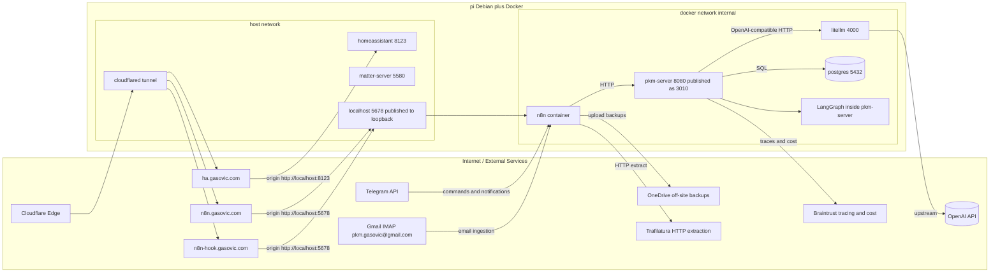

# Service Dependency Graph

## Purpose
- document the authoritative dependency topology of the PKM stack
- make trust boundaries and service edges explicit for planning, review, and architecture work
- give coding agents a single place to verify how services are expected to interact

## Authoritative For
- service-to-service dependency edges
- public exposure boundaries
- trust boundaries between external systems, host services, and internal services
- which agent role should update the graph during change work

## Not Authoritative For
- exact ports, mounts, and stack-root host paths; use `docs/env.md`
- config surface ownership and operator apply workflow; use `docs/config_operations.md`
- code placement and dependency rules inside the repo; use `docs/repo-map.md`

## Read When
- planning or reviewing cross-component changes
- changing public entrypoints, tunnels, or service boundaries
- changing how n8n, pkm-server, Postgres, LiteLLM, or external systems connect

## Update Workflow
- Planning agent: first-pass update when a design changes topology or boundaries
- Architect agent: second-pass review when the change is cross-cutting or boundary-sensitive
- Coding agent: final update to match implemented real state before the work is complete

## Service Summary

| Service / edge | Exposure | Depends on | Notes |
|---|---|---|---|
| `cloudflared` | public publishing edge | Cloudflare Edge, Pi host services | publishes public hostnames to local origins |
| `n8n` | loopback on Pi host, public via Cloudflare | Postgres, pkm-server, Telegram, Gmail IMAP, Trafilatura, OneDrive | orchestration boundary |
| `pkm-server` | LAN-only | Postgres, LiteLLM, Braintrust | internal backend boundary |
| `postgres` | internal-only | none | durable state for PKM and n8n |
| `litellm` | LAN-only | OpenAI | OpenAI-compatible proxy/router |
| `homeassistant` | public via Cloudflare | Matter Server | out of current config program unless explicitly scoped |
| `matter-server` | LAN-only / host networking | local network protocols | Home Assistant backend dependency |

## Edge Legend

| Edge type | Meaning |
|---|---|
| public publish edge | external hostname exposure boundary |
| HTTP | service-to-service application call |
| SQL | database dependency |
| upstream | external provider dependency |
| traces and cost | observability / telemetry sink |

## Trust Boundaries

| Boundary | Why it matters |
|---|---|
| Internet -> Cloudflare / public hostnames | public exposure and auth posture |
| Cloudflare / host network -> internal containers | tunnel and origin routing boundary |
| n8n -> pkm-server | orchestration-to-backend boundary; should stay API-only |
| pkm-server -> Postgres | backend-owned DB access boundary |
| pkm-server -> LiteLLM -> OpenAI | LLM routing and provider boundary |

## Topology Notes
- `pkm-server` and `litellm` are not public entrypoints.
- `n8n` UI and webhook traffic are public only through Cloudflare and terminate at Pi-host loopback publish on `localhost:5678`.
- The graph is about dependency topology, not all operational detail.
- If exact runtime values matter, verify them in `docs/env.md`.

